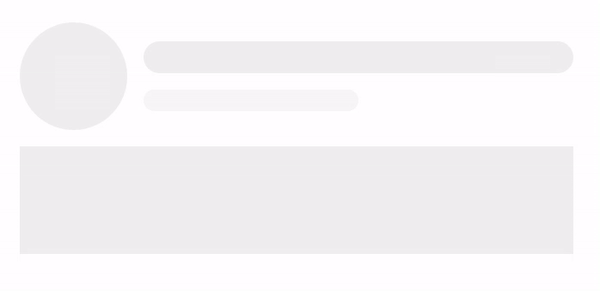

# skeleton-loader-react

A very lightweight skeleton loader for React.

## Preview



## Installation

Install the library using npm:

```
npm install https://github.com/souvik-pl/skeleton-loader-react.git
```

## Usage

Import the Skeleton component:

```tsx
import { Skeleton } from "@paul/skeleton-loader-react";
```

### Variants

The Skeleton component supports three variants: `circle`, `rectangle`, and `rectangle-rounded`.

1. **Variant:** `circle`

   ```tsx
   <Skeleton variant="circle" height="100px" width="100px" animated={true} />
   ```

   - **variant (required):** Specifies the type of skeleton loader. Use `circle` for a circular skeleton.
   - **height (optional):** The height of the skeleton. Accepts any CSS dimension in string format. Default value is `50px`.
   - **width (optional):** The width of the skeleton. Accepts any CSS dimension in string format. Default value is `50px`.
   - **animated (optional):** Whether the skeleton has an animation effect. Accepts a boolean value. Default value is `false`.

2. **Variant:** `rectangle`

   ```tsx
   <Skeleton variant="rectangle" height="100px" width="50vw" animated={true} />
   ```

   - **variant (required):** Specifies the type of skeleton loader. Use `rectangle` for a rectangular skeleton.
   - **height (optional):** The height of the skeleton. Accepts any CSS dimension in string format. Default value is `20px`.
   - **width (optional):** The width of the skeleton. Accepts any CSS dimension in string format. Default value is `100%`.
   - **animated (optional):** Whether the skeleton has an animation effect. Accepts a boolean value. Default value is `false`.

3. **Variant:** `rectangle-rounded`

   ```tsx
   <Skeleton
     variant="rectangle-rounded"
     borderRadius="10px"
     width="50vw"
     height="15px"
     animated={true}
   />
   ```

   - **variant (required):** Specifies the type of skeleton loader. Use `rectangle-rounded` for a rectangular skeleton with rounded corners.
   - **height (optional):** The height of the skeleton. Accepts any CSS dimension in string format. Default value is `20px`.
   - **width (optional):** The width of the skeleton. Accepts any CSS dimension in string format. Default value is `100%`.
   - **animated (optional):** Whether the skeleton has an animation effect. Accepts a boolean value. Default value is `false`.
   - **borderRadius (optional):** The border radius of the skeleton. Accepts any CSS dimension in string format. Default value is `8px`.

## Example

```tsx
import React from "react";
import { Skeleton } from "@paul/skeleton-loader-react";

const App = () => {
  return (
    <div>
      <h2>Circle Skeleton</h2>
      <Skeleton variant="circle" height="100px" width="100px" animated={true} />

      <h2>Rectangle Skeleton</h2>
      <Skeleton variant="rectangle" height="100px" width="50vw" animated={true} />

      <h2>Rectangle Rounded Skeleton</h2>
      <Skeleton
        variant="rectangle-rounded"
        borderRadius="10px"
        width="50vw"
        height="15px"
        animated={true}
      />
    </div>
  );
};

export default App;
```
